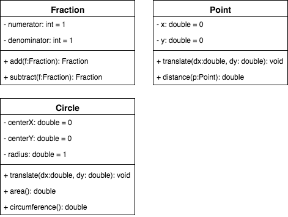

# Fraction, point, circle — with tests

Consider the following class diagram showing 3 classes. Implement the classes as specified and write tests for them. Note that getters and setters are deliberately left out of the diagram to avoid clutter.

