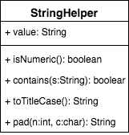

# String helper

Consider the following class design: 

Inside the `scaffolding` folder in this directory, you'll find all the code you need to get started on this drill. Taking the scaffolding as your starting point, implement the class described in the diagram above so that all of the pre-written tests pass.